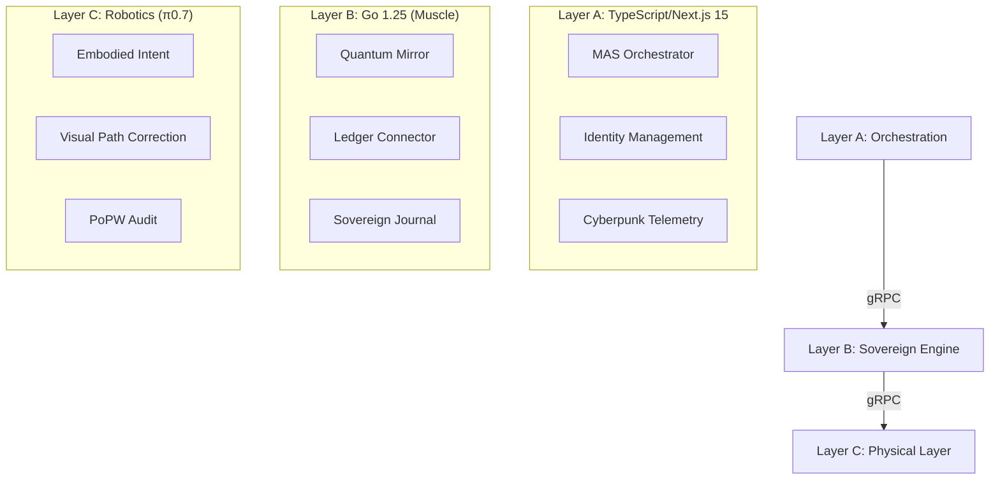

# 🌌 PiWorker-OS: The Sovereign Agent Operating System

<div align="center">
  
  <br/>
  <p>
    
    
    
    
  </p>
</div>

---

## 🏛️ Architecture: The Triple Alliance
PiWorker-OS is a **Sovereign Operating System** engineered for the **Pi Network Ecosystem**. It bridges high-level digital reasoning with physical embodied intent through a high-performance, multi-layered architecture governed by the **MAS-ZERO** protocol.

### 🧬 Sovereign Layers
<div align="center">
  
</div>



---

## 🦾 Key Pillars of Sovereignty

### 🧠 Neural Reasoning
Leveraging **Google Gemini 1.5 Pro** via a native Go SDK for deterministic goal decomposition and sub-task auditing. The OS doesn't just execute; it *understands* the intent.

### ⚛️ Quantum Mirror
Parallel simulation of 30+ persona outcomes. Before a single Pi is spent or a robot moves, the Sovereign Engine simulates the outcome across multiple timelines to ensure maximum ROI and safety.

### 💰 Profit Vortex
<div align="center">
  
</div>

An autonomous economic engine designed for the Pi Network. Agents identify bounty opportunities, execute tasks, and settle rewards natively on the blockchain with zero human intervention.

---

## 🛠️ Technical Excellence

| Component | Technology | Excellence Metric |
| :--- | :--- | :--- |
| **Sovereign Core** | Go 1.25 | Native speed & gRPC excellence |
| **Orchestrator** | Next.js 15 (React 19) | State-of-the-art UI & Edge ready |
| **Durable Execution** | DBOS-Transact | Transactional safety for all intents |
| **Identity** | AxiomDID | Sovereign decentralized identifiers |
| **Communication** | Protobuf | 10x faster than REST-based bridges |

---

## 📂 Project Topography

- `core/`: The "Brain" - Governance, Evolution, and Finance logic.
- `sidecar/`: The "Muscle" - High-performance Go Engine.
- `agents/`: The "Workforce" - Manifests and DNA definitions.
- `sandbox/`: The "Shield" - Ring-3 isolation for secure execution.
- `app/`: The "Command Center" - Cyberpunk telemetry dashboard.

---

## 🚀 Quick Ignition

### 1. Synchronize
```bash
git clone https://github.com/Moeabdelaziz007/PiWorker-OS.git
cd PiWorker-OS
```

### 2. Configure Neural Vault
```bash
cp .env.example .env
# Fill in GEMINI_API_KEY and PI_NETWORK_API_KEY
```

### 3. Deploy
```bash
make ignite
```

---

<div align="center">
  <br/>
  <sub>Built with ❤️ by <b>Amrikyy Lab</b> for the Pi Network Economy.</sub>
  <br/>
  <sub><i>Technical Sovereignty is the foundation of the Agentic Future.</i></sub>
</div>
