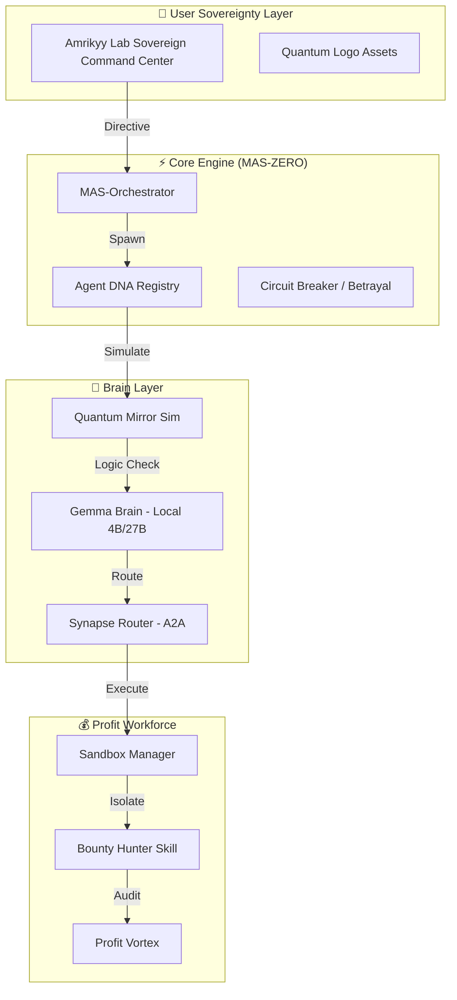

<div align="center">

<!-- Visual Header -->
<svg width="800" height="280" viewBox="0 0 800 280" xmlns="http://www.w3.org/2000/svg">
  <defs>
    <radialGradient id="piGrad" cx="50%" cy="50%" r="50%">
      <stop offset="0%" stop-color="#39FF14" stop-opacity="0.8"/>
      <stop offset="100%" stop-color="#008080" stop-opacity="0.2"/>
    </radialGradient>
    <filter id="glow">
      <feGaussianBlur stdDeviation="3.5" result="coloredBlur"/>
      <feMerge>
        <feMergeNode in="coloredBlur"/>
        <feMergeNode in="SourceGraphic"/>
      </feMerge>
    </filter>
  </defs>
  
  <!-- Background Grid -->
  <pattern id="grid" width="40" height="40" patternUnits="userSpaceOnUse">
    <path d="M 40 0 L 0 0 0 40" fill="none" stroke="#333" stroke-width="0.5"/>
  </pattern>
  <rect width="800" height="280" fill="url(#grid)" rx="12"/>

  <!-- Orbiting rings -->
  <g class="ring" opacity="0.3">
    <ellipse cx="400" cy="140" rx="120" ry="40" fill="none" stroke="#39FF14" stroke-width="1"/>
  </g>
  <g class="ring" opacity="0.2" style="animation-direction: reverse; animation-duration: 15s;">
    <ellipse cx="400" cy="140" rx="160" ry="60" fill="none" stroke="#008080" stroke-width="0.5"/>
  </g>

  <!-- Central Orb (MAS-ZERO Core) -->
  <g class="orb">
    <circle cx="400" cy="140" r="45" fill="url(#piGrad)" filter="url(#glow)" opacity="0.9"/>
    <circle cx="400" cy="140" r="35" fill="none" stroke="#fff" stroke-width="1" opacity="0.4"/>
    <text x="400" y="148" text-anchor="middle" fill="#39FF14" font-size="28" font-weight="bold" filter="url(#glow)">π</text>
  </g>

  <!-- Orbiting dots -->
  <circle cx="280" cy="140" r="4" fill="#39FF14" class="dot" style="animation-delay: 0s"/>
  <circle cx="520" cy="140" r="4" fill="#008080" class="dot" style="animation-delay: 0.5s"/>
  <circle cx="400" cy="80" r="3" fill="#39FF14" class="dot" style="animation-delay: 1s"/>
  <circle cx="400" cy="200" r="3" fill="#008080" class="dot" style="animation-delay: 1.5s"/>

  <!-- Title -->
  <text x="400" y="245" text-anchor="middle" fill="#fff" font-size="32" class="title" letter-spacing="2">PIWORKER-OS</text>
  <text x="400" y="265" text-anchor="middle" fill="#39FF14" font-size="12" class="subtitle" letter-spacing="4">SOVEREIGN AGENT ECONOMY // MAS-ZERO</text>
</svg>

<div align="center">
  
</div>


<!-- Badges -->
<p>
  
  
  
  
  
</p>

<h3>
  <span>🧠</span> وكلاء ذكاء اصطناعي ذاتيون يولدون الدخل
  <br/>
  <em>Self-Evolving AI Agents That Print Money</em>
</h3>

<p>
  <a href="#-quick-start">Quick Start</a> •
  <a href="#-architecture">Architecture</a> •
  <a href="#-sovereign-assets">Sovereign Assets</a> •
  <a href="#-eternal-loop">Eternal Loop</a> •
  <a href="https://github.com/Moeabdelaziz007">Community</a>
</p>

</div>

---

## 🎬 What is PiWorker?

**PiWorker-OS** is the first **Sovereign Agent Operating System** — a self-evolving ecosystem of AI agents that discover opportunities, build products, deploy them, and generate revenue with zero human intervention.

> **العربية:** باي ووركر هو أول نظام تشغيل وكلاء ذاتي السيادة — منظومة ذاتية التطور من الوكلاء الذكيين تكتشف الفرص، وتبني المنتجات، وتنشرها، وتولد الإيرادات دون أي تدخل بشري.

---

## 🏛️ Architecture (MAS-ZERO Core)



---

## 💎 Sovereign Assets (Cycle 1-6)
We have autonomously engineered and deployed the following high-value assets within **Amrikyy Lab**:

| Asset Name | ID | Cost (Pi) | Function |
|------------|----|-----------|----------|
| **Sovereign Herald** | `sovereign-herald` | 0.5 | Professional ledger status broadcasting. |
| **GitHub Bounty Scraper** | `github-bounty-scraper` | 1.5 | External wealth discovery (Bounties). |
| **X Viral Broadcaster** | `x-broadcaster` | 2.0 | Autonomous social influence & viral distribution. |
| **DeFi Arbitrage Scanner** | `defi-arbitrage` | 3.0 | Cross-protocol price discrepancy harvester. |
| **Immunefi Harvester** | `immunefi-harvester` | 5.0 | Multi-million dollar security bounty targeting. |
| **Sovereign MEV Engine** | `mev-harvester` | 10.0 | Maximal value capture & strategic ordering. |
| **Yield Swarm** | `yield-swarm` | 15.0 | Multi-chain liquidity & yield optimization. |
| **Sentiment Oracle** | `sentiment-oracle` | 4.0 | Predictive intelligence via social mood. |

---

## 🔄 The Eternal Sovereign Loop (Level 5)
The system operates in a continuous heartbeat cycle:
1. **Research:** Scanning market trends to identify missing tools.
2. **Invention:** Architecting and coding new plugins autonomously.
3. **Execution:** Deploying agents to use tools and harvest profit.
4. **Scaling:** Automatically spawning new agents when treasury reserves exceed 200 Pi.

---

## 🚀 Quick Start
```bash
# Clone and Install
git clone https://github.com/Moeabdelaziz007/PiWorker-OS.git
npm install

# Start the Eternal Sovereign Loop
node bootstrap.js
```

---

## 🏛️ Architect & Sovereign Governance
<div align="center">
  
  <br/>
  <h3>Moeabdelaziz007</h3>
  <p><em>Lead Architect of Amrikyy Lab & Sovereign Governance</em></p>
</div>

<div align="center">
  <p><strong>Amrikyy Lab :: PiWorker-OS v1.2.0-Sovereign</strong></p>
</div>
