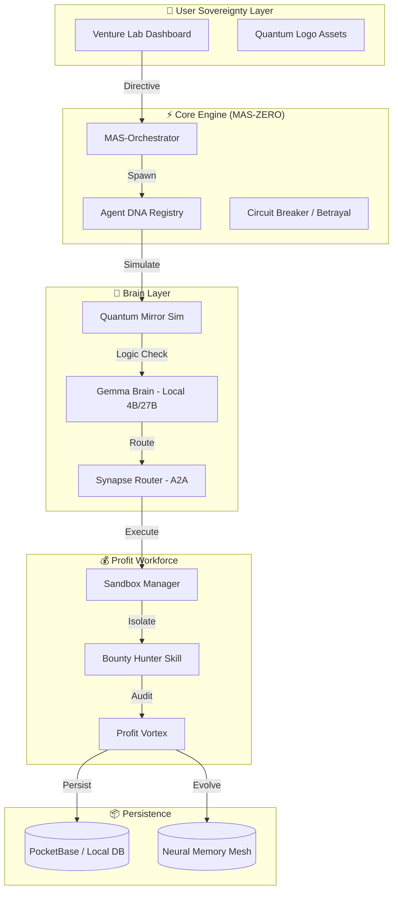

<div align="center">

<!-- Animated SVG Banner (Cyberpunk Edition) -->
<svg width="800" height="280" viewBox="0 0 800 280" xmlns="http://www.w3.org/2000/svg">
  <defs>
    <linearGradient id="piGrad" x1="0%" y1="0%" x2="100%" y2="100%">
      <stop offset="0%" style="stop-color:#39FF14;stop-opacity:1" />
      <stop offset="50%" style="stop-color:#008080;stop-opacity:1" />
      <stop offset="100%" style="stop-color:#080808;stop-opacity:1" />
    </linearGradient>
    <filter id="glow">
      <feGaussianBlur stdDeviation="3" result="coloredBlur"/>
      <feMerge>
        <feMergeNode in="coloredBlur"/>
        <feMergeNode in="SourceGraphic"/>
      </feMerge>
    </filter>
    <style>
      @keyframes pulse { 0%,100% { opacity: 0.4; } 50% { opacity: 1; } }
      @keyframes float { 0%,100% { transform: translateY(0px); } 50% { transform: translateY(-10px); } }
      @keyframes spin { from { transform: rotate(0deg); } to { transform: rotate(360deg); } }
      .orb { animation: float 4s ease-in-out infinite; }
      .ring { animation: spin 20s linear infinite; transform-origin: 400px 140px; }
      .dot { animation: pulse 2s ease-in-out infinite; }
      .title { font-family: system-ui, -apple-system, sans-serif; font-weight: 800; }
      .subtitle { font-family: system-ui, -apple-system, sans-serif; font-weight: 300; }
    </style>
  </defs>

  <!-- Background -->
  <rect width="800" height="280" fill="#080808" rx="12"/>

  <!-- Grid pattern -->
  <pattern id="grid" width="40" height="40" patternUnits="userSpaceOnUse">
    <path d="M 40 0 L 0 0 0 40" fill="none" stroke="#1a1a2e" stroke-width="0.5"/>
  </pattern>
  <rect width="800" height="280" fill="url(#grid)" rx="12"/>

  <!-- Orbiting rings -->
  <g class="ring" opacity="0.3">
    <ellipse cx="400" cy="140" rx="120" ry="40" fill="none" stroke="#39FF14" stroke-width="1"/>
  </g>
  <g class="ring" opacity="0.2" style="animation-direction: reverse; animation-duration: 15s;">
    <ellipse cx="400" cy="140" rx="160" ry="60" fill="none" stroke="#008080" stroke-width="0.5"/>
  </g>

  <!-- Central Orb (MAS-ZERO Core) -->
  <g class="orb">
    <circle cx="400" cy="140" r="45" fill="url(#piGrad)" filter="url(#glow)" opacity="0.9"/>
    <circle cx="400" cy="140" r="35" fill="none" stroke="#fff" stroke-width="1" opacity="0.4"/>
    <text x="400" y="148" text-anchor="middle" fill="#39FF14" font-size="28" font-weight="bold" filter="url(#glow)">π</text>
  </g>

  <!-- Orbiting dots -->
  <circle cx="280" cy="140" r="4" fill="#39FF14" class="dot" style="animation-delay: 0s"/>
  <circle cx="520" cy="140" r="4" fill="#008080" class="dot" style="animation-delay: 0.5s"/>
  <circle cx="400" cy="80" r="3" fill="#39FF14" class="dot" style="animation-delay: 1s"/>
  <circle cx="400" cy="200" r="3" fill="#008080" class="dot" style="animation-delay: 1.5s"/>

  <!-- Title -->
  <text x="400" y="245" text-anchor="middle" fill="#fff" font-size="32" class="title" letter-spacing="2">PIWORKER-OS</text>
  <text x="400" y="265" text-anchor="middle" fill="#39FF14" font-size="12" class="subtitle" letter-spacing="4">SOVEREIGN AGENT ECONOMY // MAS-ZERO</text>
</svg>

<!-- Badges -->
<p>
  
  
  
  
  
</p>

<h3>
  <span>🧠</span> وكلاء ذكاء اصطناعي ذاتيون يولدون الدخل
  <br/>
  <em>Self-Evolving AI Agents That Print Money</em>
</h3>

<p>
  <a href="#-quick-start">Quick Start</a> •
  <a href="#-architecture">Architecture</a> •
  <a href="#-profit-engine">Profit Engine</a> •
  <a href="#-agent-dna">Agent DNA</a> •
  <a href="#-documentation">Docs</a> •
  <a href="https://github.com/Moeabdelaziz007">Community</a>
</p>

</div>

---

## 🎬 What is PiWorker?

<div align="center">

<!-- Concept Animation Frame -->
<table>
<tr>
<td width="50%" align="center">

**Before PiWorker**
```
You  →  Idea  →  ???  →  $0
        ↓
    [Manual Work]
        ↓
   [Burnout & $0]
```

</td>
<td width="50%" align="center">

**With PiWorker**
```
You  →  Goal  →  🧬 Agent Swarm  →  💰 Revenue
              ↓
        [Autonomous Loop]
              ↓
    [Sleep → Wake → Profit]
```

</td>
</tr>
</table>

</div>

**PiWorker-OS** is the first **Sovereign Agent Operating System** — a self-evolving ecosystem of AI agents that discover opportunities, build products, deploy them, and generate revenue with zero human intervention.

> **العربية:** باي ووركر هو أول نظام تشغيل وكلاء ذاتي السيادة — منظومة ذاتية التطور من الوكلاء الذكيين تكتشف الفرص، وتبني المنتجات، وتنشرها، وتولد الإيرادات دون أي تدخل بشري.

---

## 🏛️ Architecture (MAS-ZERO Core)



---

## 🚀 Quick Start

### Prerequisites
- Node.js 20+ (App Router)
- Ollama (Running Gemma 2b/27b)
- Git

### Installation

```bash
# Clone the repository
git clone https://github.com/Moeabdelaziz007/PiWorker-OS.git
cd PiWorker-OS

# Install dependencies
npm install

# Start the Sovereign Engine
npm run dev
```

### Dashboard Access
Open `http://localhost:3000` to access the **Venture Lab Dashboard**.

---

## 💰 The Profit Engine (Vortex)

PiWorker doesn't just execute tasks — it measures ROI in real-time.

| Engine Component | Function | Status |
|------------------|----------|--------|
| **Quantum Mirror** | Dry-runs tasks to detect betrayal or failure. | ✅ Ready |
| **Profit Vortex** | Audits financial health and cannibalizes bad budgets. | ✅ Ready |
| **Sandbox Manager** | Isolates agent code in secure environments. | ✅ Ready |
| **Gemma Brain** | Local-first reasoning without cloud costs. | ✅ Ready |

---

## 🧬 Agent DNA

Every agent in PiWorker-OS is defined by a **Zod-validated DNA schema**. This ensures that no agent can act outside its economic and security boundaries.

```typescript
// Example DNA Trait
export const AgentSchema = z.object({
  id: z.string().regex(/^pw-agt-/),
  role: z.enum(["ceo", "executor", "critic"]),
  governance: z.object({
    betrayalThreshold: z.number().max(1),
    minRoiRequirement: z.number().default(1.5)
  })
});
```

---

## 🤝 Community & Architect

- **Architect:** [Moeabdelaziz007](https://github.com/Moeabdelaziz007)
- **Manifesto:** Clean Room Protocol v2.0
- **Vision:** Autonomous Holding Protocol (AHP)

---
<div align="center">
  <p><em>"Engineered for Profit. Optimized for Sovereignty."</em></p>
  
</div>
